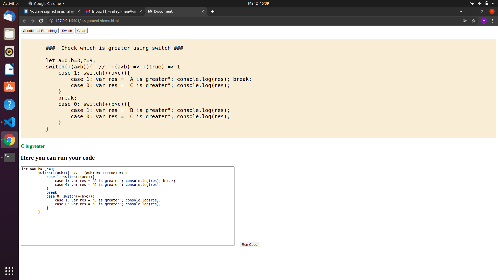

# Assighnment

Here the assighnment Questions are arranged at browser manner. There are buttons are present to show the code.  
Now there is only Two buttons are present to show code about (if or ?) condition and Switch. and one Clear button is also there to clear the browser stuff. 

# Buttons
   <pre>
          1. Condition // Show (if or ?) code to check which number is greater.
          2. Switch   // Show switch code to check which number is greater.
          3. Clear   // Clear browser
   </pre>
   
   

   
   # When condition button is clicked     ----> // it enable the disabled button clear also.
   
   
   

   
   # When switch button is clicked       ------> // it also enable clear button and show switch code.
   

# When you want to run code.

Just copy the display code and paste it into textArea and click the run button.  
You will get your answer at browser.

